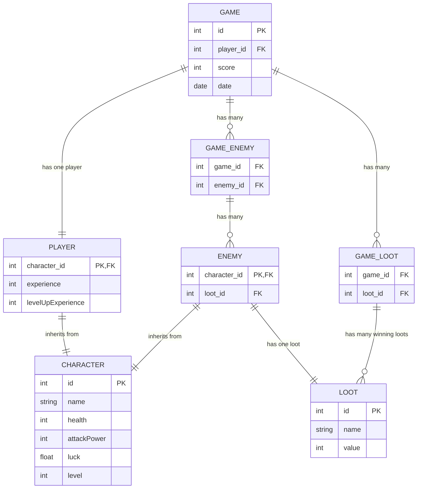

# react-rpg-game
RPG Game - implemented in TypeScript and React (FE and BE). This simple game is using using OOP with inheritance, SQLite as database, REST API over express and React as frontend.

### **Game Concept:**  
A **RPG battle game simulator** where a player can fight different types of enemies.
The game will have a **turn-based** battle system where a player fights different enemies and collect their loots.

## **1. Game Setup**
The game will provide to the player interaction with enemies (fight, defend, escape) and add randomize to the success.

### **General Classes Design and their roles:**
1. **`Character` (Base Class)**  
   - Defines common properties and behaviors for both `Player` and `Enemy`.
   - Properties: `name`, `health`, `attackPower`, `luck`, `level`
   - Methods: `attack(target: Character)`, `defend(amount: number)`, `escape(amount: number)`

2. **`Player` (Extends `Character`)**  
   - Has experience and leveling system.
   - Additional Properties: `experience`, `levelUpExperience`
   - Additional Methods: `gainExperience(amount: number)`

3. **`Enemy` (Extends `Character`)**  
   - Drop loot when defeated.
   - Additional Properties: `loot`

3. **`Loot`**  
   - Loot with score value

4. **`Game` (Manages a single gameplay of a Player)**  
   - Handles game status
   - Manages player and enemy interactions
   - Handles turns, battle logic, and game flow

## **2. Game Flow (How the Game Works)**
1. The game starts, and the player is created with default health and attack power.
2. The game presents randomized enemies one by one.
3. The player chooses an action:
   - 1. Attack
   - 2. Defend (reduce incoming damage)
   - 3. Run (escape the fight using luck and gain health)
4. The enemy takes a turn (attacks the player).
5. The game continues until all enemies are defeated or the player dies.
6. If the player gain experience and level up based based on winning.
7. The game loops with a new enemy until the player quits or dies.

## **3. Battle System (Example Turn-Based Flow)**
1. Display Player and Enemy stats.
2. Ask the player to choose an action (`attack`, `defend`, or `run`).
3. Perform the action and update health.
4. Enemy takes a turn (random attack).
5. Repeat until either the player or the enemy is defeated.

## **4. ERD Diagram**

